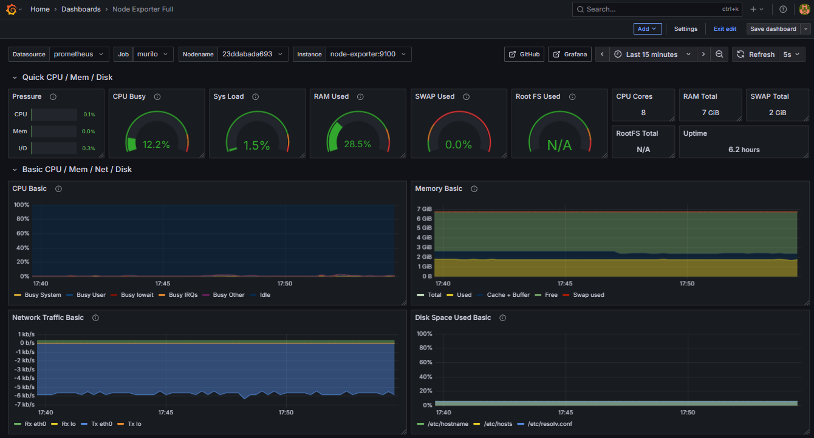

# 🐳 Monitoring Stack (Prometheus + Grafana + Node Exporter)

This project sets up a simple monitoring stack using **Docker Compose**.

## 🧱 Stack Components
- **Prometheus** – collects and stores metrics
- **Node Exporter** – exposes system metrics
- **Grafana** – visualizes metrics in dashboards

## ⚙️ How to Run
1. Clone this repository:
   ```bash
   git clone https://github.com/<your-username>/monitoring-stack.git
   cd monitoring-stack
   ```

2. Start the containers:
   ```bash
   docker-compose -f compose.yml up -d
   ```

3. Access the services:
   - Grafana → `http://localhost:3000`
   - Prometheus → `http://localhost:9090`

## 🧠 Notes
You can extend this setup to monitor remote servers or Kubernetes nodes by editing `prometheus.yml`.

## 📸 Screenshot



